<div align="center">

# ipm-lstm-attn — Learned Interior-Point Solver With A Seeded Attention Ablation

**ipm-lstm-attn is a research toolkit for learned interior-point methods (IPM) on constrained nonlinear programs. It takes a synthetic problem set through these steps to a paired, seeded comparison of learned Newton solvers:**

`generate` → `KKT system` → `learned Newton step` → `warm start` → `paired ablation`.


**[Summary](#1-summary)** ·
**[Workflow](#4-the-end-to-end-workflow)** ·
**[Run it](#10-how-to-run-ipm-lstm-attn)** ·
**[Configuration](#104-environment-variables)** ·
**[Known problems](#13-known-problems)** ·
**[Glossary](#15-glossary)**

</div>

> [!NOTE]
> This README uses ASD-STE100 Simplified Technical English. The writing rules and the project
> vocabulary are in [`docs/ste-style-guide.md`](docs/ste-style-guide.md). Each term in the
> [Glossary](#15-glossary) has only one meaning.

---

An interior-point method solves a Newton system `J dy = -F` at each outer step. The IPM-LSTM idea replaces the exact solve with a small learned solver that runs a fixed number of inner steps. The approximate iterate then gives a warm start to a classical solver. ipm-lstm-attn is a new implementation of this idea. Its main contribution is a controlled ablation of five learned variants. Each variant has one change against its parent. All variants train with several seeds on the same split, and paired bootstrap intervals compare them.

This README is the **one location that explains all of ipm-lstm-attn**. It gives these topics:

- the general design
- each component and its procedure, step by step
- the decision rules
- the data map
- the runbook
- the validation results and the known problems

| If you are… | Read |
|---|---|
| A manager or reviewer | [1](#1-summary), [3](#3-design-rules), [4](#4-the-end-to-end-workflow), [12](#12-validation-results), [14](#14-key-points) |
| A developer who joins the project | All sections, in sequence. Keep [10](#10-how-to-run-ipm-lstm-attn) and [13](#13-known-problems) open while you work |
| An operator who runs ipm-lstm-attn | [10](#10-how-to-run-ipm-lstm-attn), then the section for the component that you use |

---

## Table of contents

1. 🧭 [Summary](#1-summary)
2. 🏗️ [How ipm-lstm-attn is built](#2-how-ipm-lstm-attn-is-built)
   - 2.1 [Components](#21-components)
   - 2.2 [System context](#22-system-context)
   - 2.3 [Repository layout](#23-repository-layout)
3. 🛡️ [Design rules](#3-design-rules)
4. 🔄 [The end-to-end workflow](#4-the-end-to-end-workflow)
   - 4.1 [Full flow](#41-full-flow)
   - 4.2 [The life cycle of one instance](#42-the-life-cycle-of-one-instance)
   - 4.3 [Who does which step](#43-who-does-which-step)
5. 🔵 [Problem families and datasets](#5-problem-families-and-datasets)
6. 🟢 [The KKT system and the IPM loop](#6-the-kkt-system-and-the-ipm-loop)
7. 🟣 [The learned solvers](#7-the-learned-solvers)
8. ⚖️ [The evaluation, ablation and timing rules](#8-the-evaluation-ablation-and-timing-rules)
9. 🗂️ [Data and file map](#9-data-and-file-map)
10. ▶️ [How to run ipm-lstm-attn](#10-how-to-run-ipm-lstm-attn)
    - 10.1 [Prerequisites](#101-prerequisites) · 10.2 [Installation](#102-installation) · 10.3 [Run ipm-lstm-attn](#103-run-ipm-lstm-attn) · 10.4 [Environment variables](#104-environment-variables)
11. 🧩 [How to extend ipm-lstm-attn](#11-how-to-extend-ipm-lstm-attn)
12. ✅ [Validation results](#12-validation-results)
13. ⚠️ [Known problems](#13-known-problems)
14. 📌 [Key points](#14-key-points)
15. 📖 [Glossary](#15-glossary)
16. 📄 [License](#16-license)

---

## 1. Summary

**The problem.** A learned Newton solver can make an IPM faster, but a claim of a few percent needs a controlled and repeatable experiment. The difficult questions are:

- Which single change (a second LSTM layer, attention, a structure mask, message passing) causes a difference?
- Is a difference larger than the seed-to-seed noise?
- Is the timing comparison fair: same mode, warm-up calls, repeats, same device?
- Does fp16 weight storage change the result?

ipm-lstm-attn gives each of these questions its own component. The same code path evaluates the learned solvers and the classical solvers, so a comparison never mixes two code versions.

| Item | Value |
|---|---|
| Input | A TOML config, or the flags of `generate` |
| Output | JSON reports: evaluation, ablation with paired intervals, timing protocol, fp16 check |
| Components | **8**: problems, KKT system, IPM loop, Newton solvers, datasets, learned solvers, evaluation, timing |
| Providers | PyTorch (learned solvers), IPOPT through `cyipopt` (warm-start back-end), matplotlib (plots). All optional |
| Offline mode | Everything. No command downloads data or needs a key |
| Safety | Strict config keys, immutable datasets with SHA-256 checks, one seed for every random number generator |
| Tests | **66** unit tests (`pytest`): 50 pass in CI, 16 skip without `torch` (all 66 pass with the `torch` extra) |


---

## 2. How ipm-lstm-attn is built

### 2.1 Components

| Component | Module | Purpose |
|---|---|---|
| Problems | `src/ipm_lstm_attn/problems.py` | Objective, constraints and derivatives of one instance (`qp`, `qcqp`, `nonconvex`) |
| KKT system | `src/ipm_lstm_attn/kkt.py` | Residual `F`, Jacobian `J`, KKT error, row scaling, structure mask |
| IPM loop | `src/ipm_lstm_attn/ipm.py` | Batched primal-dual IPM with a pluggable Newton solver |
| Newton solvers | `src/ipm_lstm_attn/linsolve.py` | `DirectSolver` (LU) and `CGNormalSolver` (fixed CG budget) |
| Datasets | `src/ipm_lstm_attn/datasets.py` | Seeded generation, immutable storage, schema checks, splits |
| Config | `src/ipm_lstm_attn/config.py` | Strict pydantic schema, TOML loader, environment variables, device |
| Variant registry | `src/ipm_lstm_attn/registry.py` | The five variants and the one change of each variant |
| Learned solvers | `src/ipm_lstm_attn/models/nets.py` | LSTM cells, attention block, message-passing block (torch) |
| Training | `src/ipm_lstm_attn/models/train.py` | Seeded training inside the IPM loop, early stop, checkpoints |
| Ablation | `src/ipm_lstm_attn/models/ablation.py` | Variants × seeds, paired bootstrap against the baseline |
| fp16 check | `src/ipm_lstm_attn/models/precision.py` | Measures the effect of fp16 weight storage |
| Back-ends | `src/ipm_lstm_attn/baselines.py` | Exact IPM, IPOPT adapter, SciPy reference |
| Evaluation | `src/ipm_lstm_attn/evaluate.py` | One procedure for every Newton solver |
| Metrics | `src/ipm_lstm_attn/metrics.py` | Objective gap, violations, paired bootstrap |
| Timing | `src/ipm_lstm_attn/timing.py`, `bench.py` | Timing protocol and the pipeline benchmark |
| CLI | `src/ipm_lstm_attn/cli.py` | The `ipm-lstm-attn` command |

The component map shows which module calls which module. An arrow points from the caller to the module that it uses. The modules in `models/` need the `torch` extra.

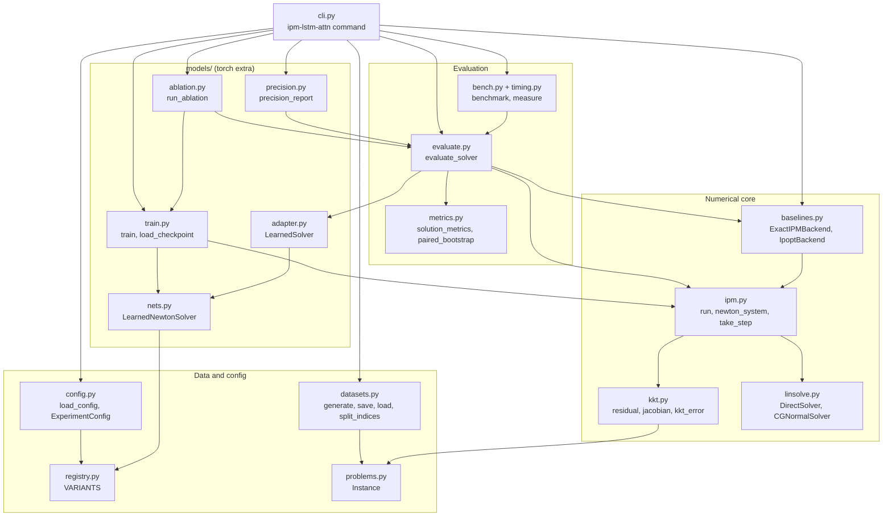

### 2.2 System context

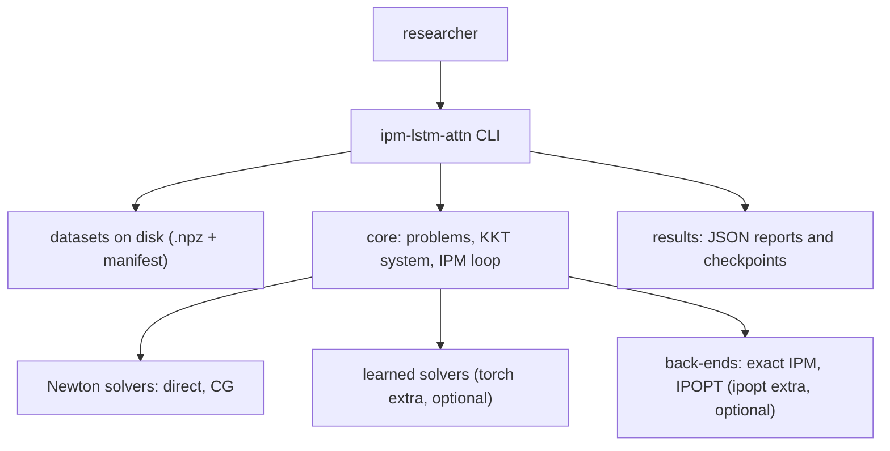

### 2.3 Repository layout

```
ipm-lstm-attn/
├── configs/                 TOML experiment configs (strict keys)
├── data/README.md           data source, file schema, rules (datasets are not committed)
├── docs/ste-style-guide.md  writing rules and project vocabulary
├── src/ipm_lstm_attn/
│   ├── problems.py kkt.py ipm.py linsolve.py      numerical core (numpy only)
│   ├── datasets.py config.py registry.py seeding.py
│   ├── evaluate.py metrics.py baselines.py timing.py bench.py plots.py
│   ├── cli.py               the ipm-lstm-attn command
│   └── models/              learned solvers: nets, adapter, train, ablation, precision (torch)
├── tests/                   pytest suite (torch tests skip without torch)
├── THIRD_PARTY.md           credit for the method and the benchmark recipe
└── pyproject.toml           package, extras and the console script
```

---

## 3. Design rules

### 3.1 One change per variant
Each variant in `registry.py` has one parent and one change. `lstm1` is the baseline. `lstm2` adds a layer. `lstm2_attn` adds attention. `lstm2_mask` adds the structure mask. `lstm2_gnn` replaces attention with message passing.

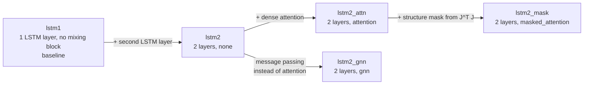

### 3.2 Strict configuration
Every config section is a pydantic model with `extra="forbid"`. An unknown key, for example `use_self_attention`, stops the run with an error. The CLI uses `parse_args`, so an unknown flag also stops the run.

### 3.3 One seed for each run
`seeding.set_seed` seeds Python, numpy and torch before the model exists. Datasets and splits use their own `numpy.random.Generator`. Two runs with the same seed give the same training losses.

### 3.4 Immutable data
`datasets.save` writes a dataset once. A second write with different content raises `ImmutableDataError`. `datasets.load` checks keys, shapes, finite values and the SHA-256 value, and the arrays are read-only.

### 3.5 One evaluation path for all solvers
`evaluate.evaluate_solver` takes any object with a `solve(J, F)` method. The exact solver, the CG solver and each learned solver go through the same steps and the same metrics.

### 3.6 Fair timing
`timing.measure` does warm-up calls, then timed repeats. Per-instance rows and batched rows stay apart. The benchmark adds only per-instance times to get the pipeline time.

### 3.7 Lazy heavy imports
The core package imports numpy, scipy and pydantic only. Torch, `cyipopt` and matplotlib load inside the functions that need them. The default device is `auto`: `cuda` if torch finds a GPU, else `cpu`.

---

## 4. The end-to-end workflow

### 4.1 Full flow

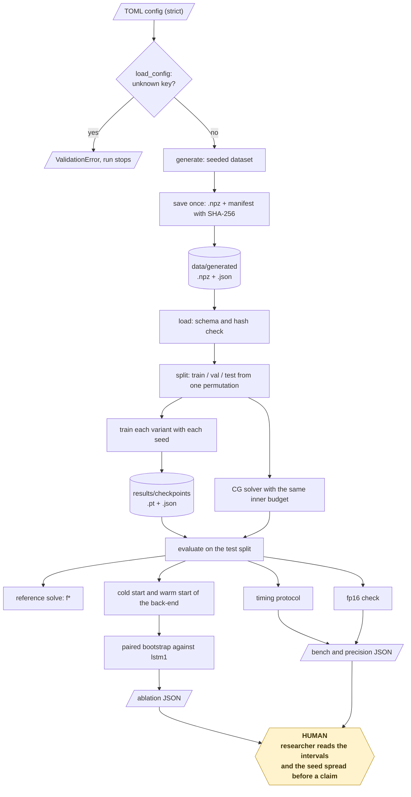

### 4.2 The life cycle of one instance

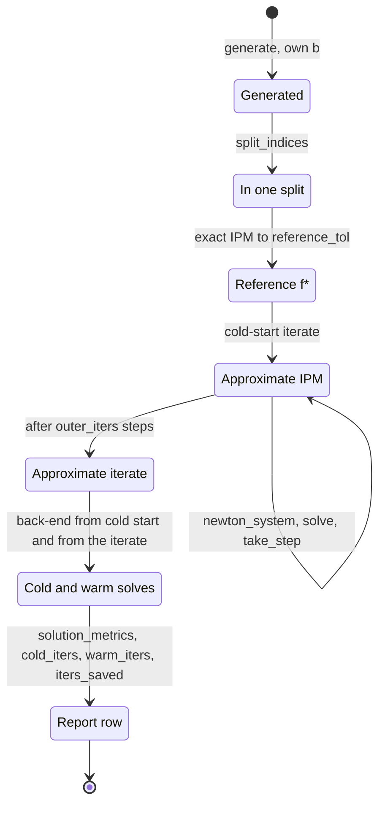

1. `generate` makes the shared matrices and one right-hand side `b` for the instance.
2. `split_indices` puts the instance index into one split only.
3. The reference solve runs the exact IPM to `reference_tol` and records `f*`.
4. The approximate IPM starts from the cold-start iterate.
5. At each outer step, `newton_system` builds `J` and `F` and scales the rows.
6. The Newton solver returns `dy`. A non-finite `dy` is replaced by zero and counted.
7. `take_step` applies the fraction-to-boundary rule, so `eta` and `s` stay positive.
8. After `outer_iters` outer steps, `solution_metrics` measures the iterate.
9. The back-end solves the instance from the cold start and from the warm start.
10. The report records the iterations of both solves and the iterations saved.

### 4.3 Who does which step

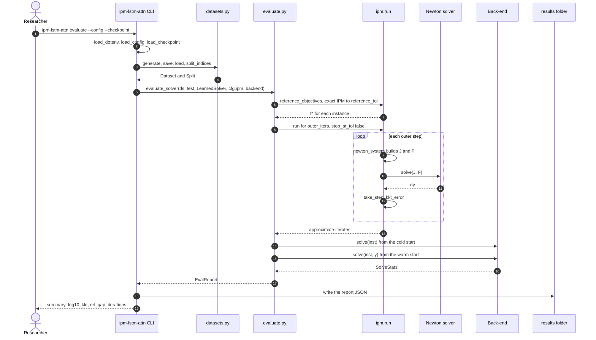

---

## 5. Problem families and datasets

**Purpose.** Make reproducible instances with a known feasible interior.

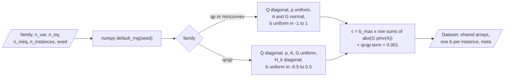

| Input | Output |
|---|---|
| `family`, `n_var`, `n_eq`, `n_ineq`, `n_instances`, `seed` | `Dataset` with shared `Q`, `p`, `A`, `G`, `c` (and `H`) and one `b` for each instance |

All families minimize `f(x)` subject to `A x = b` and `g(x) <= 0`.

| Family | Objective `f(x)` | Inequality `g(x)` | Hessian of the objective |
|---|---|---|---|
| `qp` | `0.5 x'Qx + p'x` | `Gx - c` | `Q` |
| `qcqp` | `0.5 x'Qx + p'x` | `0.5 x'H_k x + G_k x - c_k` | `Q` |
| `nonconvex` | `0.5 x'Qx + p' sin(x)` | `Gx - c` | `Q - diag(p sin(x))` |

**Procedure**

1. Draw `Q` (diagonal), `p`, `A`, `G` (and diagonal `H_k` for `qcqp`) from a seeded generator.
2. Draw one `b` for each instance from a bounded uniform distribution.
3. Compute `c` so that `x = pinv(A) b` is strictly feasible for every possible `b`.
4. Save the arrays once with a manifest, then load them back with all checks.

**Rules**

- A test checks strict feasibility of `pinv(A) b` for every generated instance of every family.
- The split takes all arrays of an instance from one index. The prototype took the inequality data of the test split from the validation rows. This design makes that mistake impossible.

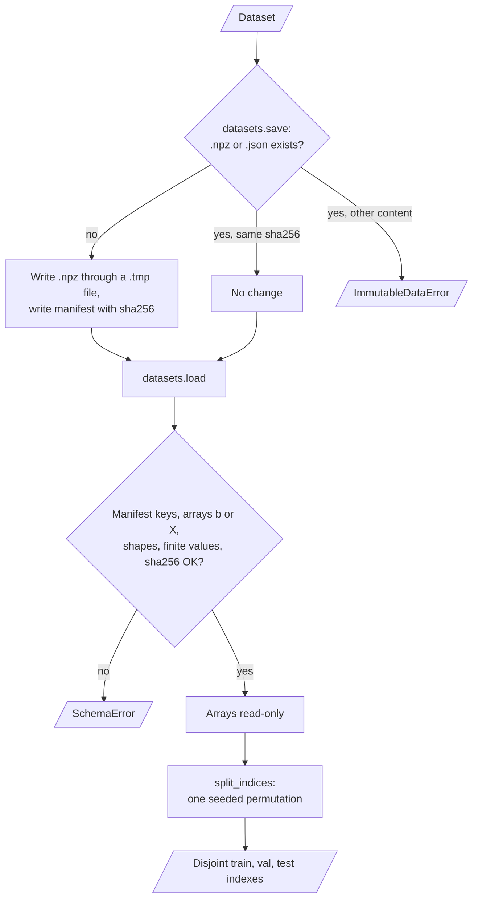

---

## 6. The KKT system and the IPM loop

**Purpose.** Solve each instance with a primal-dual IPM and a pluggable Newton solver.

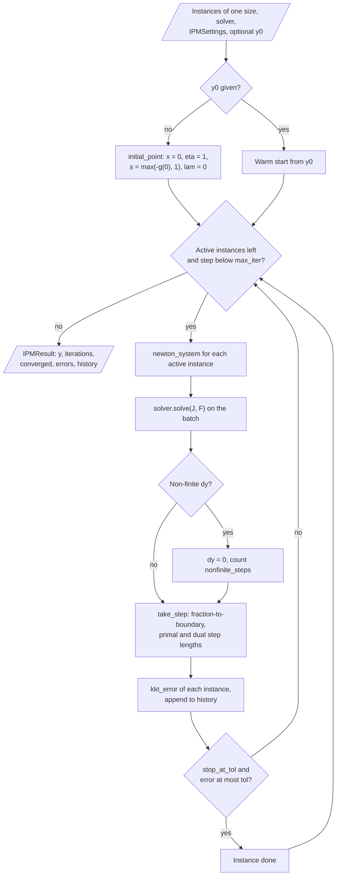

| Input | Output |
|---|---|
| Instances of one size, a Newton solver, `IPMSettings`, an optional warm start | `IPMResult`: iterates, iterations, convergence flags, KKT error history |

The iterate is `y = [x, eta, s, lam]`. The residual for the barrier parameter `mu` is:

```
F = [ grad f(x) + A' lam + Jg(x)' eta ;  g(x) + s ;  eta * s - mu ;  A x - b ]
```

`newton_system` builds one Newton system in these steps:

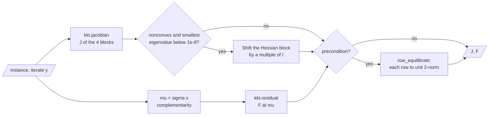

**Procedure**

1. Compute `mu = sigma * mean(eta * s)`.
2. Build `F` and its Jacobian `J`. For `nonconvex`, shift the Hessian block until it is positive definite.
3. Scale each row of `J dy = -F` to unit length (`precondition = true`).
4. Get `dy` from the Newton solver.
5. Compute the primal and the dual step lengths with the fraction-to-boundary rule (`tau`).
6. Update the iterate. Stop an instance when its KKT error is at most `tol`, if `stop_at_tol` is true.

**Rules**

| Setting | Default | Meaning |
|---|---|---|
| `sigma` | `0.1` | Centering factor |
| `tau` | `0.995` | Fraction-to-boundary factor |
| `outer_iters` | `20` | Outer budget of the approximate IPM |
| `reference_tol` | `1e-8` | Tolerance of the reference solve |
| `warm_tol` | `1e-6` | Tolerance of the cold start and the warm start |
| `reference_max_iter` | `200` | Iteration limit of every back-end solve |

The KKT error is the largest of `max|grad L|`, `max|A x - b|`, `max|g(x) + s|` and `mean(eta * s)`. A test compares the exact IPM with SciPy `trust-constr` on each family.

---

## 7. The learned solvers

**Purpose.** Return an approximate `dy` for a Newton system in a fixed number of inner steps.

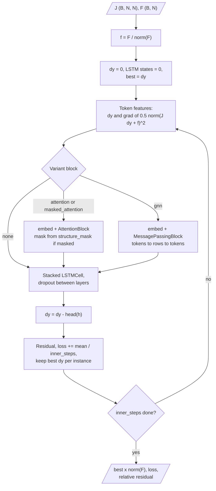

| Input | Output |
|---|---|
| `J` (B, N, N) and `F` (B, N) | `dy` (B, N), the training loss, the relative residual of `dy` |

**Procedure**

1. Divide `F` by `||F||`. The system is linear in `F`, so the solver works at unit scale.
2. Start with `dy = 0` and zero LSTM states.
3. For each token, compute two features: the value of `dy` and the gradient of `0.5 ||J dy + F||^2`.
4. If the variant has a mixing block, embed the features and apply the block.
5. Apply the stacked LSTM cells with shared weights. Dropout acts between layers in training mode only.
6. Subtract the output of the linear head from `dy`.
7. Keep, for each instance, the `dy` with the smallest residual. Multiply it by `||F||`.

| Variant | LSTM layers | Mixing block | Change against the parent |
|---|---|---|---|
| `lstm1` | 1 | none | baseline (upstream design) |
| `lstm2` | 2 | none | second LSTM layer |
| `lstm2_attn` | 2 | multi-head attention, residual, layer norm | dense attention |
| `lstm2_mask` | 2 | the same attention | structure mask from `J^T J` |
| `lstm2_gnn` | 2 | message passing tokens → rows of `J` → tokens | message passing instead of attention |

**Rules**

- The training loss is the mean of `0.5 ||J dy + F||^2 / ||F||^2` over the inner steps.
- The IPM moves with the detached `dy`, so the gradient does not flow across outer steps.
- Early stop watches the mean log10 KKT error on the validation split after the outer budget.
- A checkpoint holds the weights and the model config. `load_checkpoint` uses `weights_only=True`.

`models/train.py` trains one variant with one seed inside the IPM loop:

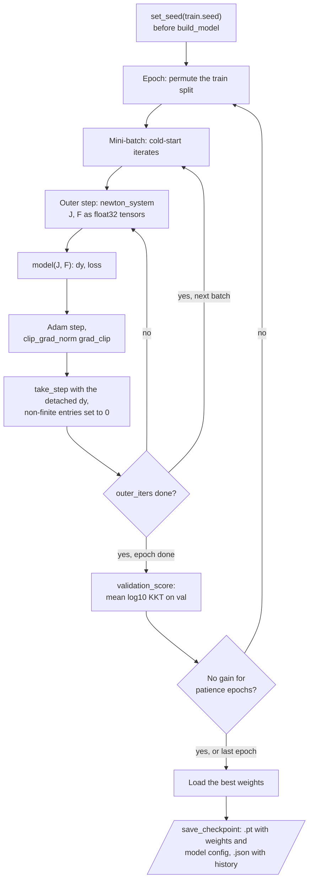

---

## 8. The evaluation, ablation and timing rules

**Evaluation.** Each report holds, for each test instance:

| Field | Meaning |
|---|---|
| `rel_gap` | `abs(f - f*) / max(1, abs(f*))` |
| `eq_max`, `eq_mean` | Largest and mean `abs(A x - b)` |
| `ineq_max`, `ineq_mean` | Largest and mean `max(g(x), 0)` |
| `kkt_worst`, `log10_kkt` | KKT error and its base-10 logarithm |
| `cold_iters`, `warm_iters`, `iters_saved` | Back-end iterations from the cold start and from the warm start |
| `cold_s`, `warm_s`, `warm_converged` | Back-end times and the convergence flag |

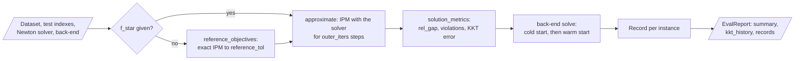

**Ablation.**

1. Train every variant with every seed on the same split.
2. Average each metric over the seeds for each test instance.
3. Compute the paired difference against the baseline with a 95% percentile bootstrap (`bootstrap` resamples).
4. Mark a difference as significant only if the interval excludes zero.
5. Report the standard deviation of the seed means.
6. Evaluate `cg<inner_steps>` once as the non-learned reference with the same inner budget.

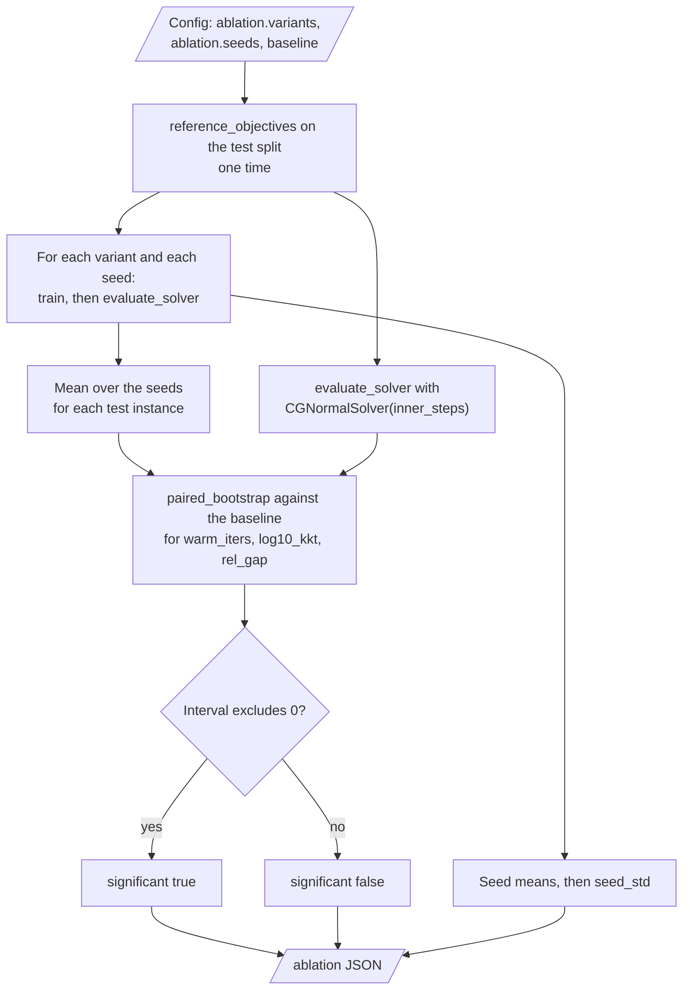

**Timing protocol.**

| Row | Mode | Batch size |
|---|---|---|
| Approximate IPM | `per_instance` | 1 |
| Approximate IPM | `batched` | `bench.batch_size` |
| Back-end cold start | `per_instance` | 1 |
| Back-end warm start | `per_instance` | 1 |

The pipeline time is the per-instance approximate IPM time plus the per-instance warm-start time. Each row is a median over `repeats` calls after `warmup` calls. The report records the Python, numpy and torch versions, the thread count and the device.

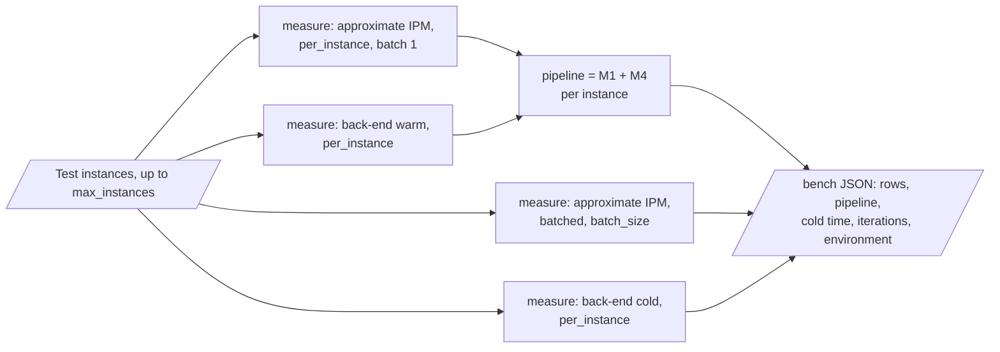

**fp16 check.** `precision-check` stores each weight as float16, reads it back as float32 and runs the same evaluation. The IPM residuals stay in float64. The report gives the change in log10 KKT error and in warm-start iterations.

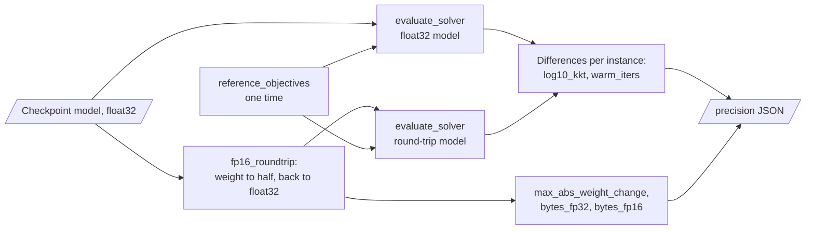

---

## 9. Data and file map

| Path | Committed? | Contents |
|---|---|---|
| `configs/*.toml` | Yes | Experiment configs: `qp_small`, `qcqp_small`, `nonconvex_small`, `qp_100`, `ablation_quick` |
| `data/README.md` | Yes | Data source, file schema and rules |
| `data/generated/*.npz`, `*.json` | No (git ignores it) | Datasets and manifests |
| `results/*.json` | No (git ignores it) | Evaluation, ablation, timing and fp16 reports |
| `results/checkpoints/*.pt`, `*.json` | No (git ignores it) | Weights, model config and training history |
| `.env` | No (git ignores it) | Local values of the environment variables |
| `.env.example` | Yes | Names of the environment variables |

---

## 10. How to run ipm-lstm-attn

### 10.1 Prerequisites

| Need | For |
|---|---|
| Python 3.11+ | All components |
| PyTorch (`torch` extra) | `train`, `evaluate`, `ablate`, `precision-check`, the learned part of `demo` |
| IPOPT library and `cyipopt` (`ipopt` extra) | `--backend ipopt` only. Install with `conda install -c conda-forge cyipopt` |
| matplotlib (`plot` extra) | `plot` |

### 10.2 Installation

```bash
git clone https://github.com/KrishnaAnnavaram/ipm-lstm-attn.git
cd ipm-lstm-attn
python -m venv .venv
. .venv/bin/activate            # Windows: .venv\Scripts\activate
pip install -e ".[dev]"         # core and tests
pip install -e ".[torch]"       # learned solvers (optional)
```

### 10.3 Run ipm-lstm-attn

```bash
# offline demo: classical solver only, or with two learned variants if torch is installed
ipm-lstm-attn demo --no-torch
ipm-lstm-attn demo

# check a config (an unknown key is an error)
ipm-lstm-attn check-config configs/qp_small.toml

# write one dataset (written once, then read-only)
ipm-lstm-attn generate --family qcqp --n-var 20 --n-eq 10 --n-ineq 10 --n-instances 500 --seed 17

# classical Newton solvers, no torch
ipm-lstm-attn baseline --config configs/qp_small.toml --solver cg --cg-iters 10
ipm-lstm-attn baseline --config configs/qp_small.toml --solver direct

# learned solvers
ipm-lstm-attn train --config configs/qp_small.toml --variant lstm2_mask --seed 0
ipm-lstm-attn evaluate --config configs/qp_small.toml --checkpoint results/checkpoints/qp_small_lstm2_mask_seed0.pt
ipm-lstm-attn ablate --config configs/ablation_quick.toml
ipm-lstm-attn bench --config configs/ablation_quick.toml --checkpoint results/checkpoints/ablation_quick_lstm2_mask_seed0.pt
ipm-lstm-attn precision-check --config configs/ablation_quick.toml --checkpoint results/checkpoints/ablation_quick_lstm2_mask_seed0.pt

# IPOPT as the warm-start back-end (ipopt extra)
ipm-lstm-attn evaluate --config configs/qp_small.toml --checkpoint <file.pt> --backend ipopt

# plot the KKT error history of evaluate reports (plot extra)
ipm-lstm-attn plot results/qp_small_cg10_test.json --out results/kkt.png
```

Each command with `--config` prepares the data in the same steps before it does its own work:

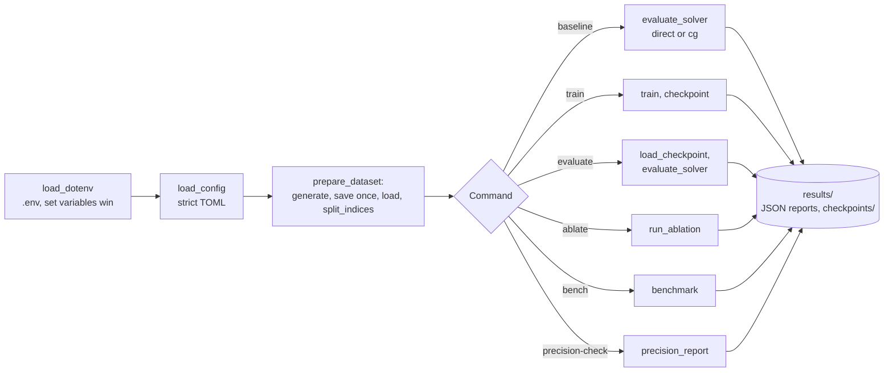

### 10.4 Environment variables

| Variable | Used by | Meaning |
|---|---|---|
| `IPM_LSTM_ATTN_DATA_DIR` | all commands with data | Dataset folder. Default `data/generated` |
| `IPM_LSTM_ATTN_RESULTS_DIR` | all commands with output | Report and checkpoint folder. Default `results` |
| `IPM_LSTM_ATTN_DEVICE` | `train`, `evaluate`, `ablate`, `bench` | `auto`, `cpu` or `cuda`. Default `auto`. The flag `--device` wins |

The CLI reads a local `.env` file for these three names. A variable that is already set wins. The project uses no credentials.

---

## 11. How to extend ipm-lstm-attn

| You want to… | Do this | Code change? |
|---|---|---|
| Run a larger study | Copy `configs/qp_small.toml` and change the sizes and the seeds | No |
| Add a problem family | Add the family to `FAMILIES` and to the methods of `Instance`, then to `datasets.generate` | Small |
| Add a variant | Add a `Variant` to `registry.py` with its parent and its one change, then the block in `nets.py` | Small |
| Add a classical Newton solver | Write a class with `name` and `solve(J, F)` | Small |
| Add a back-end | Write a class with `name` and `solve(inst, y0)` that returns `SolveStats`, then add it to `make_backend` | Small |
| Add a metric | Add a field to `SolutionMetrics` and to the `summary` loop in `evaluate.py` | Small |

---

## 12. Validation results

All numbers come from synthetic data on one laptop CPU. They show that the pipeline runs end to end. They are not a result on a real benchmark.

| Validation | Result | Command |
|---|---|---|
| Unit tests (with torch) | **66 passed** | `pytest -q` |
| Unit tests in CI (no torch) | **50 passed, 1 module skipped (16 tests)** | `pip install -e ".[dev]"` then `pytest -q` |
| Exact IPM against SciPy `trust-constr` | Objective difference below `1e-5` on each family | `pytest tests/test_ipm.py` |
| Offline demo (synthetic, 12 test instances, 1 seed) | See table 12.1 | `ipm-lstm-attn demo` |
| Quick ablation (synthetic, 60 test instances, 3 seeds) | See table 12.2 | `ipm-lstm-attn ablate --config configs/ablation_quick.toml` |

**12.1 Offline demo.** `qp` family, 10 variables, outer budget 8, inner budget 8, 4 epochs.

| Newton solver | Mean log10 KKT error | Mean objective gap | Cold-start iterations | Warm-start iterations |
|---|---|---|---|---|
| `cg8` | -0.492 | 0.1365 | 9.17 | 7.08 |
| `learned:lstm1` | -0.151 | 0.4709 | 9.17 | 7.00 |
| `learned:lstm2_mask` | -0.171 | 0.0674 | 9.17 | 6.83 |

**12.2 Quick ablation.** `qp` family, 10 variables, 240 instances (60 test), outer budget 8, inner budget 8, 5 epochs, seeds 0, 1 and 2. The cold start of the exact IPM needs 9.0 iterations on average. Each interval is a 95% paired bootstrap over the 60 test instances, after the mean over the seeds.

| Newton solver | Warm-start iterations | log10 KKT error | Objective gap | Δ warm-start iterations vs `lstm1` [95% CI] | Δ objective gap vs `lstm1` [95% CI] |
|---|---|---|---|---|---|
| `lstm1` (baseline) | 7.194 | -0.187 | 0.291 | — | — |
| `lstm2` | 7.139 | -0.219 | 0.261 | -0.056 [-0.133, +0.017] | -0.030 [-0.044, -0.017] |
| `lstm2_attn` | 7.161 | -0.320 | 0.185 | -0.033 [-0.106, +0.039] | -0.106 [-0.131, -0.081] |
| `lstm2_mask` | 7.161 | -0.232 | 0.104 | -0.033 [-0.089, +0.022] | -0.187 [-0.209, -0.166] |
| `lstm2_gnn` | 7.139 | -0.261 | 0.286 | -0.056 [-0.139, +0.028] | -0.005 [-0.041, +0.030] |
| `cg8` (not learned) | 7.017 | -0.459 | 0.135 | -0.178 [-0.272, -0.078] | -0.156 [-0.181, -0.133] |

These numbers show three facts about this small synthetic setting:

- No learned variant saves a significant number of warm-start iterations against `lstm1`. Each interval includes zero.
- Attention and the structure mask reduce the objective gap of the approximate iterate. The seed-to-seed standard deviation of the gap is 0.05 to 0.19, so three seeds are not sufficient for a firm claim.
- The classical `cg8` solver with the same inner budget beats every learned variant on warm-start iterations and on the KKT error.

**12.3 Timing protocol** (`bench`, `lstm2_mask` seed 0, 10 test instances, 1 warm-up call, 3 repeats, CPU, float32 model):

| Row | Mode | Median time per instance |
|---|---|---|
| Approximate IPM, `learned:lstm2_mask` | `per_instance`, batch 1 | 34.2 ms |
| Approximate IPM, `learned:lstm2_mask` | `batched`, batch 10 | 7.5 ms |
| Exact IPM, cold start | `per_instance`, batch 1 | 2.1 ms |
| Exact IPM, warm start | `per_instance`, batch 1 | 1.6 ms |

At this size the exact IPM is much faster than the two-stage pipeline (35.8 ms against 2.1 ms per instance). The learned solver has value only where an exact Newton solve is expensive. This benchmark does not show such a size.

**12.4 fp16 check** (`precision-check`, same checkpoint, 60 test instances): fp16 storage halves the weights from 33,668 to 16,834 bytes. The largest weight change is 0.00044. The largest change of log10 KKT error on one instance is 0.022, and the warm-start iterations do not change.

The prototype reported 1.9% fewer IPOPT iterations and 6.5% less time on 100-variable QPs with attention. That is a prototype result, not reproduced here.

---

## 13. Known problems

Read these problems before you use ipm-lstm-attn for a research claim.

| # | Area | Problem | Impact and action |
|---|---|---|---|
| 1 | Results | The CI runs no training. The results above are small synthetic runs on one CPU | Do not quote them as benchmark results. Run `configs/qp_100.toml` with 5 seeds for a real study |
| 2 | Data | The nonconvex QP benchmark files of the upstream project (`qp1`, `st_rv*`) are not supported | Only synthetic families are available |
| 3 | IPOPT | The IPOPT back-end needs a system library. No test runs it | Check `--backend ipopt` on your machine before you use it |
| 4 | Scale | The KKT system is dense. The cost of attention grows with N² and the Python loop builds one system at a time | Sizes above a few hundred unknowns are slow |
| 5 | Nonconvex | The Hessian shift makes each Newton step a descent step, but the IPM has no merit function or line search | A run can stop at a local point or fail to converge. Check `warm_converged` |
| 6 | Timing | Python overhead of the KKT build is part of every timing row | The rows compare solvers fairly, but absolute times are not those of a compiled solver |
| 7 | fp16 | The check covers weight storage only. Inference stays in float32 | A full fp16 inference path is not measured |

---

## 14. Key points

1. **Each variant changes one thing.** A paired difference against the parent then has one cause.
2. **A config key that the code does not know is an error.** No setting is ignored without a message.
3. **Seeds control everything.** The same seed gives the same weights, the same split and the same losses.
4. **Learned and classical solvers share one evaluation path.** The CG solver with the same inner budget is the fair non-learned reference.
5. **Datasets are immutable.** No command edits a dataset file, and the loader checks the SHA-256 value.
6. **Timing rows never mix modes.** Per-instance and batched times are separate rows.

---

## 15. Glossary

| Term | Meaning |
|---|---|
| **IPM** | Interior-point method: Newton steps on the barrier KKT system with `eta > 0` and `s > 0` |
| **instance** | One optimisation problem with its own `b` |
| **iterate** | The vector `y = [x, eta, s, lam]` at one outer step |
| **Newton system** | `J dy = -F` at one iterate |
| **Newton solver** | A component that returns `dy`: `direct`, `cg<k>` or `learned:<variant>` |
| **variant** | One learned solver design from `registry.py` |
| **token** | One entry of `dy` with its two features |
| **mixing block** | The attention or message-passing layer between tokens |
| **structure mask** | The pattern of `J^T J`: tokens that share a row of `J` |
| **outer budget** | The fixed number of outer steps of the approximate IPM |
| **reference solve** | The exact IPM run to `reference_tol` that gives `f*` |
| **back-end** | The solver for the warm-start comparison: `exact_ipm` or `ipopt` |
| **cold start / warm start** | A back-end solve from the default iterate / from the approximate iterate |
| **KKT error** | The largest of the dual residual, the primal residuals and the mean complementarity |
| **objective gap** | `abs(f - f*) / max(1, abs(f*))` |
| **paired difference** | The mean of (variant minus baseline) over test instances, with a bootstrap interval |
| **timing protocol** | Warm-up calls, repeats, and separate per-instance and batched rows |

---

## 16. License

[MIT](LICENSE) © 2026 Krishna Annavaram

The method credit is in [THIRD_PARTY.md](THIRD_PARTY.md).
